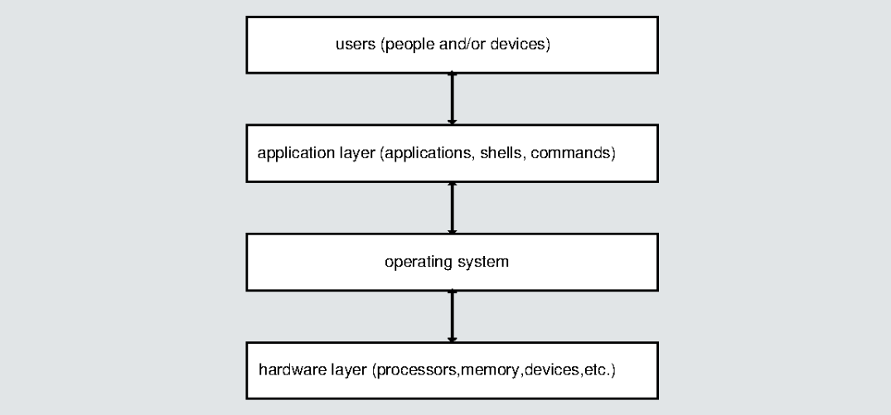
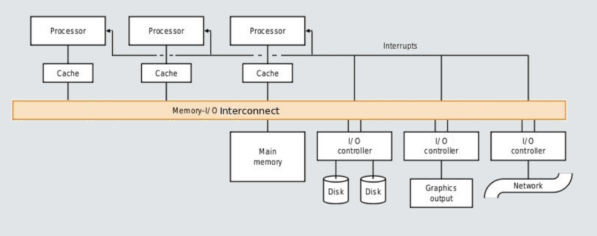

# Introduction to Operating Systems

## Computer System Components

In general, a system is a cohesive collection of interrelated and interdependent
parts. A computer system includes the hardware and the software that together
make the aggregate usable by users, which include not just people, but machines
or other "things":

* **Hardware** includes processors, I/O devices, all types of memory and
  secondary storage.
* **Software** includes the operating system and the software that uses it,
  which is called the application layer.
* The **operating system** (OS) is the software that interacts directly with the
  hardware; applications do not interact with the hardware.
* The **application layer** includes software development tools, web browsers,
  all types of media editors and viewers, shells, commands, etc. **User data is
  part of the application layer**.

### Layered Structure of a Computer System

The components of a computer system form a sequence of **layers**.

Only adjacent layers have interactions with each other. For example:

* applications don't directly communicate with or control hardware, after all
the operating system sits between them and mediate their interaction.
* users only interact with the application (which includes shells like `bash` in
Linux).

### Operating System Requirements

The layered structure of a computer system implies that an operating system has
three important responsibilities: 

1. The operating system alone must control the hardware resources. 
2. The operating system alone must enable and control the execution of all other
   software on the computer. 
3. The operating system must give users the ability to develop, run, and manage
   applications and their data.

But these are not the only things for which operating systems are responsible.

### Other Considerations

There are other considerations that affect what else operating systems is
required to do. There are requirements coming from **what users want**: 

* Users want their time on the computer to be spent **efficiently**.
* Users want their data to be **secure**.
* Users want the computer's usage to be as **convenient and easy as possible**.
* Users may want to be able to **share** data and applications **selectively with
  other users**. 

A computer, on some level, exists to produce value, directly or indirectly, for
its owner. The more productive it is, the more value is created
for the owner. This leads to additional requirements: 

* The computer resources should be **utilized as efficiently as possible**,
  maximizing the amount of work it performs per unit time. 
* The computer resources should be **protected** from all possible intentional
  and unintentional abuses.
* It should be possible to **allocate resources as needed** among various users.

### Additional Operating System Requirements

Preceding considerations lead to these additional tasks that operating systems
must perform:

* An operating system should manage the resources of a computer system in such
  a way as to allow **reliable sharing of data and applications**.
* An operating system should provide **security and protection** of all hardware and
  software on the computer system.
* An operating system should provide **robust error handling and recovery**.
* An operating system should allocate resources fairly to users while trying to
  **maximize overall throughput, minimize response time** to as many users as
  possible, and **maximize the utilization of all hardware resources in the system**.

### Operating System Services

The most common services performed by operating systems can be categorized as
follows:

* **Program execution**, loading and executing programs; providing
  synchronization, communication, and security.
* **I/O operation**, providing all I/O services to users and applications.
* **File systems**, creating and maintaining file systems and means of
  manipulating them. 
* **Communication**, providing mechanisms that allow programs to communicate
  with each other.
* **Error detection and recovery**, detecting and handling error conditions.
* **Protection and security**, preventing unauthorized or improper access to all
  resources, and protecting users from each other's attempts to invade privacy
  or corrupt data.
* **Accounting**, monitoring and recording various performance and utilization
  metrics, for both users and the system.

### How to Define "Operating System"?

People disagree about the definition of the term "operating system":

* Some say it is just the program, often called the **kernel**, that is loaded into
  memory on start-up and remains in memory, controlling the computer, until it
  is shut down.
* Others say it is the collection of programs, including the kernel, that
  provide services to applications and users, including all **system programs**. 
  
To remove all ambiguity in this course, we make the following definition: 

> **the operating system is the kernel program and nothing more**.

### System Programs

This is a fuzzy concept at best. 

**System programs** are typically programs shipped or downloaded when the
operating system is installed. For example: 

* **Software updaters/package managers** - programs that track, download, and
  install updates to your operating system or other software or install new
  software.
* **Compilers, linkers, loaders, debuggers, etc.** - programs that enable you to
  build your own software. 
* **File management commands** such as commands to navigate the file system,
  list directories, and so on. 

On a Linux system, system programs include most of the commands that you
typically type on the command line. To be more precise, these are commands that
are found in the directories, `/bin`, `/usr/bin`, `/usr/sbin`, and `/sbin`.

Almost all of these programs can only be invoked as commands on the command line
(CLI) in a terminal window, but there are some that can (also) be invoked
through a graphical user interface (GUI) such as Gnome using menus or clickable
icons. 

**Do not confuse system programs with applications**. Applications are usually programs
then end-users install themselves. Some applications come "bundled" with the
operating system for your convenience. Applications are typically installed in
the directories `/usr/local/bin` or `/opt`.

## Computer Organization

We examine the physical components of a computer system and how they interact
with each other.

### The General Structure of a Typical Computer 

A modern, general-purpose computer consists of one or more **CPUs**, one or more
**memory units**, and a set of **device controllers**, all of which are connected by a
common **bus**, usually called the **system bus**. The figure below illustrates how
these components interconnect. Notice that there is a separate line labeled
"interrupts", to be discussed shortly. 

### Main Components of a Computer

* **CPUs.** Most modern computers contain more than one processor. When several
  processors are integrated into a single chip, each one is called a **core** and
  the machine itself is called a **multi-core processor**.
* **System Bus.** The system bus is a single communication path that connects
  the major components of a computer system, combining the functionality of a
  **data bus**, an **address bus**, and a **control bus**. A system bus
  typically consists of many parallel wires. The number of wires is called the
  width of the bus.
* **Memory.** Memory units are self-contained primary storage, i.e.
  random-access, devices. They are usually volatile (i.e., require power to
  maintain the stored information) and are connected directly to the system bus.
  
  Memory units are controlled by a **memory controller**, which synchronizes
  access to the memory from the devices that want to access it, and responds to
  requests to transfer data to and from memory.

* **Device Controllers.** A **device controller** is a special-purpose processor
  that controls a specific type of device, such as a disk or a keyboard. It may
  be connected to multiple instances of this type of device, or just one.

  It typically has a number of special-purpose registers, buffer memory, and
  control logic that responds to specific instructions.

  A device controller is responsible for moving data between the devices that it
  controls and its local memory. It responds to instructions submitted to it
  through the bus, and can query the status of the attached devices.

  Because device controllers are special-purpose microprocessors with their own
  unique instruction sets, the software to control them is also highly
  specialized and specific to each different one. For example, the code needed
  for an Ultra320 SCSI disk controller is very different from the code needed
  for a Parallel ATA disk controller.

  This is why the code written to control each controller is separated from the
  rest of the operating system and placed into its own module called a **device
  driver**.

### Device Drivers

In a modern operating system, **every device controller has an associated device
driver**. 

A **device driver** is a program or software module that can "drive" that
controller in much the same way that a person can drive a car. It "knows" the
controller's instruction set and its interface and can send instructions to the
device to perform actions, such as to read a number of blocks of data from a
disk to transfer to a memory location, or to stop or start the device.

Most operating systems have the ability to detect which device drivers they need and
integrate them into the operating system itself as separate modules. 

The primary purpose of device drivers is to provide a **layer of abstraction**, so
that the operating system programmers do not need to know the details of the
device controllers to write code to perform tasks using those devices.

For example, a serial port might only present two "public" functions, one to send
data and one to receive data. A device driver that implements these functions would
communicate with the particular serial port controller installed on the
computer. **Different serial ports have different instruction sets and
architectures**, so each serial port may have a different device driver, but each
device driver hides the hardware-specific differences and presents the same
software interface to the software layer above. The operating system programmer
just needs to know the common software interface that the device drivers present
to them.

### Computer System Operations

Computer System Operations Peripheral devices such as keyboards, mice, network
interfaces, and external storage devices can operate concurrently with the
processors. For example, a program might be running on a CPU while a user types
on a keyboard, or moves a mouse, or while data is arriving from the local
network.

These concurrent activities usually involve moving data to or from
memory, and/or may require that the CPU take some specific action in response to
specific events.

For example, when the user types a "Control-C" on the keyboard while a terminal
window has focus and a program is running in the terminal's command line (the
shell), that program is typically terminated. Somehow, that Control-C must be
detected and the fact of its occurrence transmitted to a program that can
terminate the running program. A lot has to happen to make this work.

* What part of this is done by hardware? Which hardware?
* What part of this is done by software? Which software? 

The key to all of this is the use of **interrupts**. 

**All modern operating systems are interrupt-driven**; after the boot completes,
they run only as a result of interrupts.

### Typical I/O Read Operation

To illustrate, we discuss what happens when a running program issues a request
to read data from a hard disk. The program's **read request** causes a device
driver to run. We ignore the steps leading to this for now. 

* The device driver loads the appropriate registers in the device controller in
  order to start the read operation. When it has done this, some other program
  is chosen to run on the CPU.
* The device controller responds by examining the contents of these registers
  and it determines (1) that it is a read operation and (2) which data must be
  read.
* The controller starts the transfer of the data from the device to its local
  buffer. When the transfer of data is complete, the device controller informs
  the device driver that it has finished its operation.
* The device driver runs again. It is responsible for the remainder of the work,
  which includes notifying the operating system that the I/O is complete and
  transferring the data to an appropriate place in memory.

**How does the controller inform the device driver that it has finished its
operation?** By issuing an **interrupt request**.

### Interrupt Overview 

What are interrupts and interrupt requests? 

An **interrupt** is a temporary break in the continuity of the process running
on the processor in order to respond to some condition needing attention. 

When an interrupt takes place, the state of the processor is saved, and special code
runs that handles the specific condition requiring attention. This code is
called either an **interrupt service routine** (ISR) or an **interrupt handler**.

A device needing attention can request an interrupt by sending a signal to the
processor. This signal is called an **interrupt request**. The acronym **IRQ** is short
for **interrupt request**. 

**The distinction between interrupts, interrupt requests, and the events
requiring attention is often blurred**, and people may call any of
them an interrupt for short. Thus, if a hard disk completed a read operation and
issued an IRQ as a result of it, we might say it issued an interrupt, or it
raised an interrupt, and we might also say the read event itself caused an
interrupt.

### Interrupts Step-By-Step

A simplification of what happens during an interrupt is as follows:

1. A device issues an interrupt request by sending a signal on the system bus.
2. The signal is received by the CPU.
3. The CPU saves the value of the program counter (PC).
4. It loads the PC with the starting address of the interrupt service routine
   for that device. 
5. The contents of the remaining registers are saved in an appropriate place.
6. The interrupt service routine (ISR) runs. 
7. When the ISR finishes, the saved registers are restored and the PC is loaded
   with the saved value; the interrupted computation is resumed.

**Question:** Step 4 suggests that the CPU knows which device caused the interrupt. How does it know this?

**Question:** In step 4, how does the system know the starting address to load
ino the PC?

### Finding and Running the Interrupt Service Routine (ISR)

There are two different methods of determining which device caused the interrupt
and where the starting address of its interrupt service routine is stored.

#### Method 1: Polling the devices (rarely used)

An IRQ (interrupt request) is received by the CPU but it does not indicate which
device caused the interrupt. 

There is a single ISR that runs when an interrupt occurs. This ISR sends a
signal to each device that amounts to the question, "did you just send an IRQ?".
The first device to answer "yes" is the one that will be serviced. The ISR has
code that causes a jump to the correct device driver. 

This method is called **polling** because it polls each device. **It is inefficient**.

#### Methd 2: Vectored interrupts (almost always used)

The interrupt lines on the bus are **vectored**, meaning each device can send
its identity along with the IRQ. When the CPU receives the IRQ, 
it can extract the identity of the device that needs service. The identity is an
integer value. 

The system maintains a table, usually in low memory, that maps each integer
device identity to the starting address of its ISR. This table is called the
**interrupt vector** or **the interrupt vector table**. If there are many
devices, sometimes the table is a linked list of ISR addresses.

### Interrupt Masking 

There are two types of interrupts:

* A **maskable interrupt** is one that can be disabled temporarily. There is a
register that contains a bit (0 or 1) for each interrupt type, and that bit is used to
determine whether or not to disable (i.e., mask) the interrupt. Maskable
interrupts are non-critical. 

* A **non-maskable interrupt** is one that cannot be disabled. It must be
  serviced. It is not affected by the interrupt mask register. Examples are
  errors from memory and timer interrupts. 

In some systems, disabling an interrupt means ignoring it completely. In others,
it is possible to defer processing the interrupt if it is disabled. **Deferred
interrupts** are saved, usually in a queue, and handled in a specific order at a
future time.

### Interrupt Priorities 

Some interrupts have higher priorities than others: if the CPU is in the middle
of servicing an interrupt request, and a higher priority request occurs, it
should interrupt the current ISR. On the other hand, if an interrupt request has
lower priority then the one being serviced by the CPU should be ignored.

Most systems have a method of **prioritizing interrupts**, either in hardware alone,
or in both hardware and software.

**Example:** The mask register can be used to set the interrupt priority level
of the processor using a left-to-right ordering of the mask bits. 

* Each device has an associated priority level, and the ISR for that device runs
  at that priority level. The **priority level** is an integer corresponding to a
  bit position.
* If an interrupt occurs whose bit is to the left of another one, it has higher
  priority. If its mask bit is on, it is enabled, otherwise it is disabled.
* By turning off all bits to the right of a given bit, the processor masks all
  interrupts whose priority is lower than the given one. 
* If a lower priority interrupt occurs, it is ignored. If one occurs that is at
  equal or higher priority, the currently running ISR is interrupted and the ISR
  for the new one runs.

### Traps and Exceptions

In English, an **exception** is defined to be an uncommon event. In computing it
is supposed to be an uncommon event. 

An **exception** is a software-generated interrupt. It is caused by the
execution of a software instruction. Examples of exceptions are 

* floating-point errors such as divide-by-zero, 
* attempts to execute invalid opcodes, and 
* attempts to access memory locations outside of the process's allowed memory. 

The term **trap** is often used as a synonym for exception, but it is NOT. **Traps
are a specific type of exception**: all traps are exceptions, but not all
exceptions are traps.

* The Intel 80x86 architecture defines a trap as follows: A trap is a
  programmer-initiated (and consequently expected) transfer of control to a
  handler routine. (The `int` assembly instruction is a trap.)
* In the Linux kernel, a trap is a specific type of exception. There are other
  types of exceptions as well. On Intel chips, the `eip` register is queried to
  decide the type. 

In short, traps are actual instructions coded into programs intentionally that
cause an interrupt, whereas exceptions are any interrupts generated by software.
We will see how traps are used in the next chapter, when we discuss **system calls**.

### Interrupt-Driven I/O 

Recall that modern operating systems are **interrupt-driven**; they only run as
a result of interrupts.

All I/O occurs as a result of interrupts. 

To illustrate this, in the figure below, we have augmented the sequence of steps
described in the slide, *Typical Read Operation* to show how interrupts are used
in the read operation.

